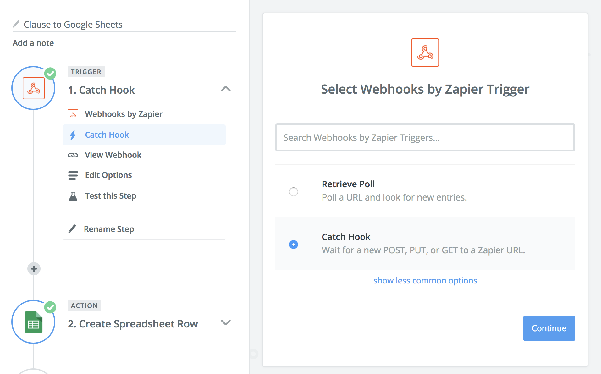
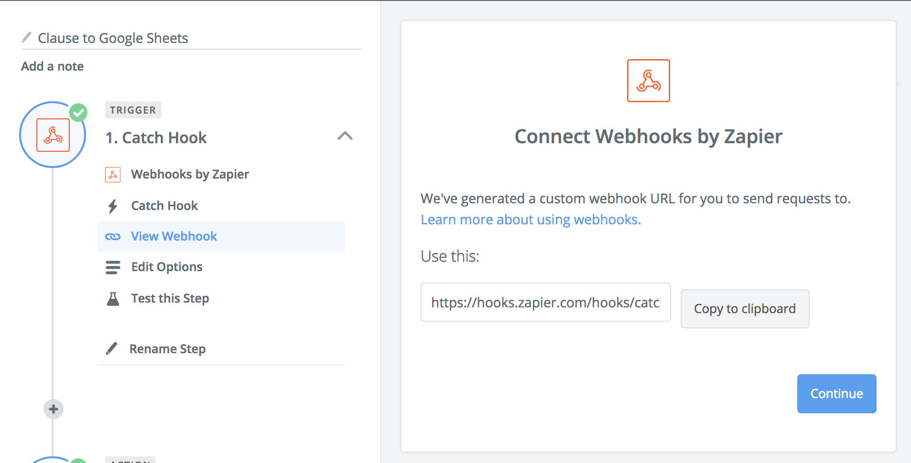
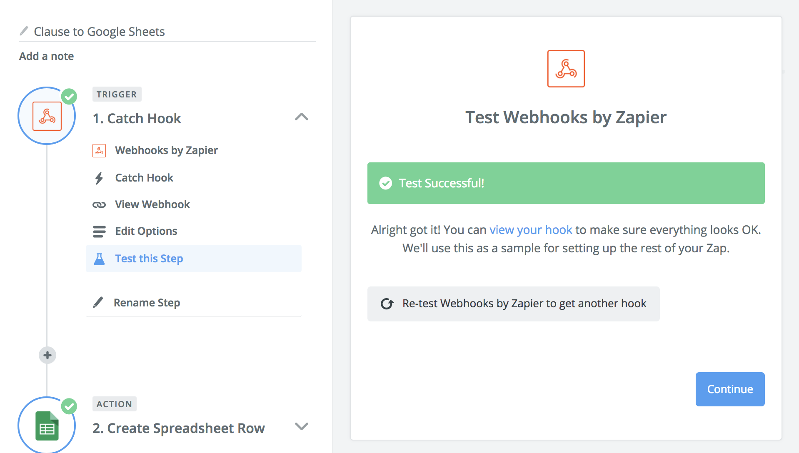

# HTTP Post Sample Clause

This is a smart legal clause conforms that to the [Accord Protocol Template Specification](https://docs.google.com/document/d/1UacA_r2KGcBA2D4voDgGE8jqid-Uh4Dt09AE-shBKR0), the protocol is managed by the open-source community of the [Accord Project](https://accordproject.org). The clause can be parsed and executed by the [Cicero](https://github.com/accordproject/cicero) engine and is designed to run on the [Clause platform](https://clause.io)

## Description

> This sample clause demonstrates how to send data to an external URL. 

You are encouraged to copy this sample when building your own Smart Clause that needs to make a HTTP request.

For example, we can use this clause to send data to a [Zapier Web Hook](https://zapier.com/apps/webhook/integrations) from where we can forward on a message to [many hundred other online services](https://zapier.com/apps/integrations).

### Sample Payload Data

Request, as in [data.json](https://github.com/accordproject/cicero-template-library/blob/master/acceptance-of-delivery/data.json)
```json
{
    "$class": "io.clause.samples.integration.httppost.Request",
    "data": "{ \"date\":\"2018-02-10\", \"note\":\"my note\",\"quantity\":1,\"unitPrice\":10.0}"
}
```

For the request above, you should see the following response:
```json
{
    "$class":"io.clause.outbound.physical.Http",
    "method":"POST",
    "url":"http://localhost:1880/alert",
    "body":"{ \"date\":\"2018-02-10\", \"note\":\"my note\",\"quantity\":1,\"unitPrice\":10.0}",
    "transactionId":"b70311b1-88e1-4b3d-b6c2-84c8ee3d8eb7",
    "timestamp":"2018-02-18T13:26:20.886Z"
}
```
The url in the response comes from the value in the [clause text](sample.txt). When executing this clause on the [Clause platform](https://clause.io), this response is automatically understood and the platform will make the HTTP request.


## Integrating Clause with Google Sheets

This guide explains how to use Zapier to recieve a message from Clause and to add it to a row in a Google Sheets spreadsheet. This example can be completed with free accounts from [Zapier](https://zapier.com/sign-up) and [Google](https://accounts.google.com/SignUp?service=wise&continue=https%3A%2F%2Fdocs.google.com%2Fspreadsheets%2F%3Fusp%3Dmkt_sheets&ltmpl=sheets).

### Setting up your Contract

For illustration, we will use the following example data. We assume that this is generated by your application or Cicero template.

```js
const data = { 
    "date":"2018-02-10",
    "note":"my note",
    "quantity":1,
    "unitPrice":10.0
};
```

To have Clause call Zapier automatically, your Cicero template logic should have return type, `io.clause.outbound.physical.Http`. You should also set the response fields as follows.
```js
/**
 * ...
 * @param {io.clause.outbound.physical.Http} context.response - the response
 * @AccordClauseLogic
 */
function execute(context) {
    // ...
    var res = context.response;
    res.url = YOUR_ZAPIER_WEB_HOOK_URL;
    res.method = 'POST';
    res.body = JSON.stringify(data);
}

```

If testing your integration with the `integration-httppost` sample clause (for example via the Clause execution REST API), then you should send the following payload.
```json
{
    "$class": "io.clause.samples.integration.httppost.Request",
    "data": "{ \"date\":\"2018-02-10\", \"note\":\"my note\",\"quantity\":1,\"unitPrice\":10.0}"
};
```
The value of the data attribute is equivalent to `JSON.stringify(data)`.

### Creating a Zap on Zapier

[Create your zap](https://zapier.com/app/editor), and choose `Webhooks` as the trigger from the list of built-in apps.

Then when configuring your webhook, choose the `Catch Hook` option.



Zapier will generate a unique URL for your integration. You should use this in your contract code, so that Clause knows where to send your data. 

> i.e. replace `YOUR_ZAPIER_WEB_HOOK_URL` in the code above with the value in this field.



Sending a test message during setup of Zapier is crucial as this allows Zapier to know the format of messages it will recieve. It is recommended that you use the Clause `/execute` REST API to emit a test message.



Once successful you can use the Action editor to configure your connection to Google Sheets and to map the fields from your test message. You should choose `Create Spreadsheet Row` from the Google Sheets action wizard.

> Note. Your spreadsheet should already exist on Google Sheets before you try this step.


All done!

Now each time your clause executes, you will add a new row to your spreadsheet.